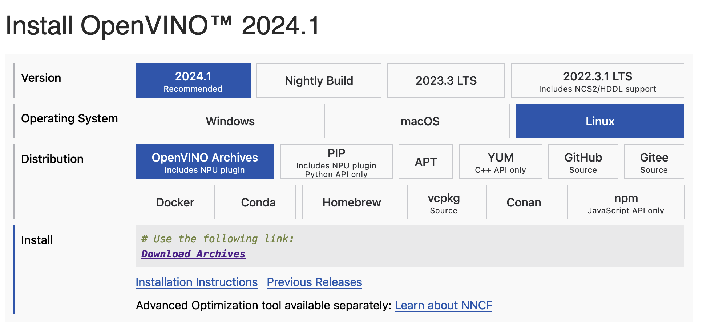
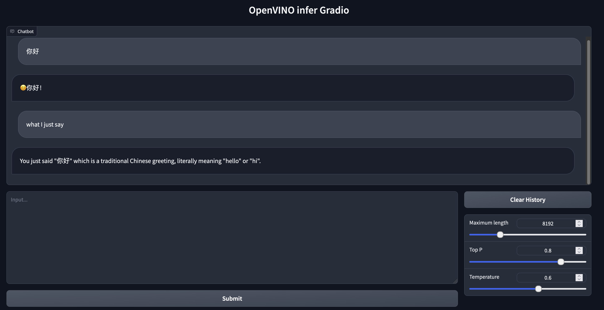

# OpenVino 加速套件

## 工具介绍

* [OpenVINO](https://github.com/openvinotoolkit/openvino) 是英特尔提供的一个用于优化和部署深度学习模型的开源软件工具包。在计算机视觉、自动语音识别、生成式
  AI、自然语言处理以及使用大型和小型语言模型和许多其他常见任务中提升深度学习性能。

* 本模块将主要使用 OpenVINO 构建和推理一系列大型语言模型（LLMs）。

## 安装官方配置和对应的仓库

## 安装OpenVINO

本仓库使用的是 `OpenVINO™ 2024.1`
版本进行实验。确保您按照[官方手册](https://docs.openvino.ai/2024/get-started/install-openvino.html)安装正确的正确的发行版。这里展示了下载界面的截图。



+ 不同版本之间的模型可能并不通用。
+ GPU 和 CPU 安装方式有一定区别，请严格按照官方文档进行安装。
+ 使用 `OpenVINO™ 2024.1` 之前的版本，在使用GPU推理的时，如果本机带有非英伟达的独立显卡，可能遇到如下报错：

```shell
[general error(-1) Exception from src\inference\src\core.cpp:116:
[ GENERAL_ERROR ] Check 'supports_allocation(type) || type == allocation_type::cl_mem' failed at src\plugins\intel_gpu\src\runtime\ocl\ocl_engine.cpp:129:
[GPU] Unsupported allocation type: usm_host
```

## 制作引擎

这里以 llama3作为例子，首先，我们需要克隆仓库

```shell
git clone https://github.com/OpenVINO-dev-contest/llama2.openvino
```

按照本教程进行模型转换和量化。

```shell
python export.py --model_id '/home/zr/Models/Meta-Llama-3-8B-Instruct' --output /home/zr/Models/Meta-Llama-3-8B-Instruct-intel            
```
在模型转换的时候，你可能会遇到一些警告，但这些警告不会影响运行。
```
Loading checkpoint shards: 100%|█████████████████████████████████████████████████████████████████████████████████████████████████████████████████████████████████████████████████████████████████████████| 4/4 [00:05<00:00,  1.36s/it]
/home/zr/Code/chatglm3.openvino/venv/lib/python3.10/site-packages/transformers/modeling_attn_mask_utils.py:114: TracerWarning: Converting a tensor to a Python boolean might cause the trace to be incorrect. We can't record the data flow of Python values, so this value will be treated as a constant in the future. This means that the trace might not generalize to other inputs!
  if (input_shape[-1] > 1 or self.sliding_window is not None) and self.is_causal:
/home/zr/Code/chatglm3.openvino/venv/lib/python3.10/site-packages/transformers/modeling_attn_mask_utils.py:162: TracerWarning: Converting a tensor to a Python boolean might cause the trace to be incorrect. We can't record the data flow of Python values, so this value will be treated as a constant in the future. This means that the trace might not generalize to other inputs!
  if past_key_values_length > 0:
/home/zr/Code/chatglm3.openvino/venv/lib/python3.10/site-packages/transformers/modeling_attn_mask_utils.py:411: TracerWarning: Converting a tensor to a Python boolean might cause the trace to be incorrect. We can't record the data flow of Python values, so this value will be treated as a constant in the future. This means that the trace might not generalize to other inputs!
  if query_length > 1 and not is_tracing:
/home/zr/Code/chatglm3.openvino/venv/lib/python3.10/site-packages/transformers/models/llama/modeling_llama.py:150: TracerWarning: Converting a tensor to a Python boolean might cause the trace to be incorrect. We can't record the data flow of Python values, so this value will be treated as a constant in the future. This means that the trace might not generalize to other inputs!
  if seq_len > self.max_seq_len_cached:
/home/zr/Code/chatglm3.openvino/venv/lib/python3.10/site-packages/transformers/models/llama/modeling_llama.py:716: TracerWarning: Converting a tensor to a Python boolean might cause the trace to be incorrect. We can't record the data flow of Python values, so this value will be treated as a constant in the future. This means that the trace might not generalize to other inputs!
  if attention_mask.size() != (bsz, 1, q_len, kv_seq_len):
/home/zr/Code/chatglm3.openvino/venv/lib/python3.10/site-packages/torch/jit/_trace.py:165: UserWarning: The .grad attribute of a Tensor that is not a leaf Tensor is being accessed. Its .grad attribute won't be populated during autograd.backward(). If you indeed want the .grad field to be populated for a non-leaf Tensor, use .retain_grad() on the non-leaf Tensor. If you access the non-leaf Tensor by mistake, make sure you access the leaf Tensor instead. See github.com/pytorch/pytorch/pull/30531 for more informations. (Triggered internally at aten/src/ATen/core/TensorBody.h:489.)
  if a.grad is not None:
 --- exporting tokenizer --- 
Special tokens have been added in the vocabulary, make sure the associated word embeddings are fine-tuned or trained.
```

+ 量化模型为int4精度，方便以更快的速度进行推理。

```shell
python3 quantize.py --model_id /home/zr/Models/Meta-Llama-3-8B-Instruct-intel --precision int4 --output /home/zr/Models/Meta-Llama-3-8B-Instruct-intel-int4
```

执行效果
```
INFO:nncf:NNCF initialized successfully. Supported frameworks detected: torch, onnx, openvino
 --- loading model --- 
 --- using local model --- 
 --- compressing model --- 
 --- exporting int4 model --- 
Searching for Mixed-Precision Configuration ━━━━━━━━━━━━━━━━━━━━━━━━━━━━━━━━━━━━━━━━━━━━━━━━━━━━━━━━━━━━━━━━━━━━━━━━━━━━━━━━━━━━━━━━━━━━━━━━━━━━━━━━━━━━━━━━━━━━━━━━━━━━━━━━━━━━━━━━━━━━━━━━━━━━━━━━━━ 100% 224/224 • 0:01:02 • 0:00:00
INFO:nncf:Statistics of the bitwidth distribution:
+--------------+---------------------------+-----------------------------------+
| Num bits (N) | % all parameters (layers) |    % ratio-defining parameters    |
|              |                           |             (layers)              |
+==============+===========================+===================================+
| 8            | 31% (68 / 226)            | 20% (66 / 224)                    |
+--------------+---------------------------+-----------------------------------+
| 4            | 69% (158 / 226)           | 80% (158 / 224)                   |
+--------------+---------------------------+-----------------------------------+
Applying Weight Compression ━━━━━━━━━━━━━━━━━━━━━━━━━━━━━━━━━━━━━━━━━━━━━━━━━━━━━━━━━━━━━━━━━━━━━━━━━━━━━━━━━━━━━━━━━━━━━━━━━━━━━━━━━━━━━━━━━━━━━━━━━━━━━━━━━━━━━━━━━━━━━━━━━━━━━━━━━━━━━━━━━━━━━━━━━━ 100% 226/226 • 0:02:12 • 0:00:00
```

### 运行简单的推理模型

执行效果

```
--- loading tokenizer --- 
Special tokens have been added in the vocabulary, make sure the associated word embeddings are fine-tuned or trained.
 --- reading model --- 
 --- model compiling --- 
 --- start generating --- 
 --- text decoding --- 
Response:  OpenVINO is an open-source computer vision framework developed by Intel. It is designed to optimize computer vision models for deployment on Intel-based hardware, such as CPUs, GPUs, and FPGAs. OpenVINO provides a set of tools and libraries that allow developers to build, optimize, and deploy computer vision applications on Intel-based hardware.

OpenVINO supports a wide range of computer vision tasks, including:

1. Image classification: OpenVINO can be used to classify images into different categories using deep learning models.
2. Object detection: OpenVINO can be used to detect objects in images and videos using deep learning models.

 --- Benchmarking --- 
Input length: 6 tokens
Generated 129 tokens in 21.29 s on CPU
Maximum rss memory consumption: 13666.32 MB, Maximum shared memory consumption: 5302.25  MB
First inference latency: 3808.27 ms/token, Other inference latency 134.66 ms/token in average
```

## 使用 WebUI 接口

```shell
python webui_infer.py  --model_path {your_openvino_engine_path} --device "CPU"
```

之后，您可以在gradio页面上进行访问，效果如下:


### 可参考资料

+ [OpenVINO Cookbook](https://github.com/openvinotoolkit/openvino_notebooks?tab=readme-ov-file#-installation-guide):
  一系列现成的 Jupyter 笔记本，用于学习和实验 OpenVINO™工具包。这些笔记本提供了 OpenVINO 基础知识的介绍，并教开发者如何利用我们的
  API 进行优化的深度学习推理。

+ [Llama,GLM,Qwen + OpenVINO](https://github.com/OpenVINO-dev-contest/): 一些常见大模型的转换代码和推理加速子仓库。
